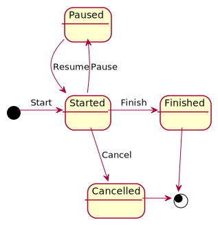

# testing
Test project for automated testing:unit, integration, component, ui

## Software Requirements
* [Docker Desktop](https://www.docker.com/products/docker-desktop)
* Git client, for example [git desktop](https://desktop.github.com)
* [Fiddler everywhere](https://www.telerik.com/download/fiddler-everywhere)
* [Postman](https://www.postman.com/downloads)

## How to use

1. Clone repository(git clone).
2. Checkout specific branch(git checkout).
3. Get last version (git pull).
4. Goto to "TestWebApp2" folder.
5. Run in ps or command line:

   ```sh
   docker-compose build
   docker-compose up
   ``` 
6. Launch browser at http://localhost:5000 or http://<your_hostname>:5000

## Domain

ToDo state diagram



## Rest Api

To see api documentation goto to [Swagger docs](http://localhost:5000/api-docs)

## gRPC

To see gRPC contracts go to folder TestWebApp2/Protos

To test grpc service:
1. Download [grpc ui](https://github.com/fullstorydev/grpcui/releases)
2. Run in command line or ps ()


